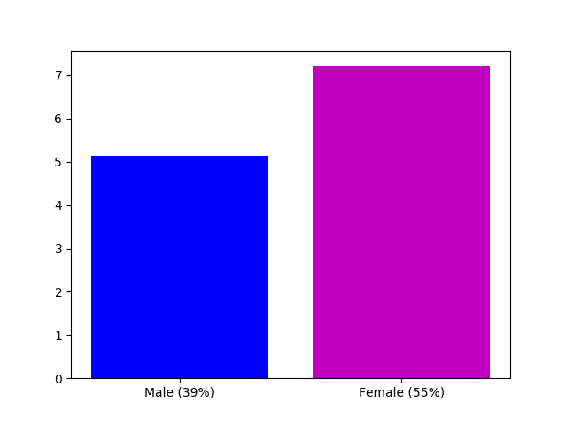
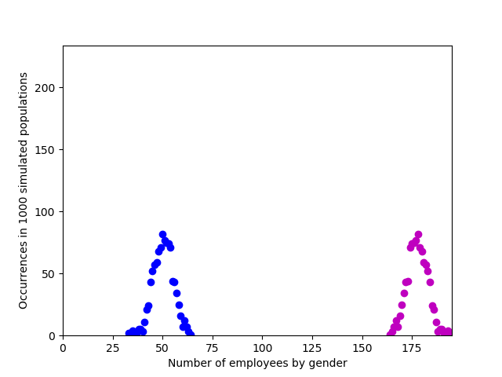

Note - there is some unknown bug in this program. Don't trust the results.

# LinkedIn Gender Machine

A command-line-interface app that guesses at the gender-proportions of companies who have LinkedIn profiles. Caveat: you can't tell someone's gender from their name, for a variety of reasons. So take the data with a pinch of salt.

The library I'm using for guessing genders provides a probability estimate, so for example 'James' returns 0.99 probability of being male. If the company had only one employee, named James, LinkedIn Gender Machine would estimate that 0.99 employees were male. The default assumption is that names of unknown gender are 50% likely to be male; this constant can be customized.






## Installation

Make sure geckodriver is intalled and on PATH. Also make sure Firefox is installed.

Create and activate the virtual environment. Then:

```
$ pip install -r requirements.txt
```

Create a .env file in the root directory, and put in LINKEDIN_USERNAME=<your_username> and LINKEDIN_PASSWORD=<your_password>.

## Uses

To use fake sample data in example_response.py:
```
$ python script.py
```

To extract data from a real company page:
```
$ python script.py <company_url>
```
e.g.

```
$ python script.py https://www.linkedin.com/company/tails-com
```

